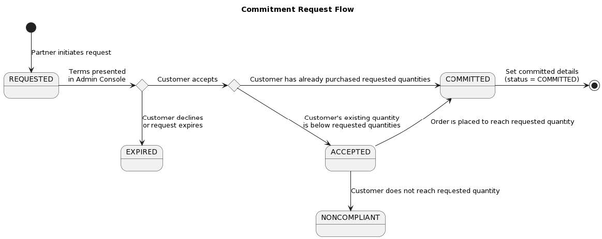

# Manage Three-Year Commits

Three-Year Commit (3YC) is a loyalty program that allows customers to get a greater discount level and a price lock for three terms (the current term and two additional terms). Customers commit to a minimum quantity they must purchase and maintain throughout the 3-year commitment period.

Using the Preview Order API to determine the correct discount level is important. Preview Order uses the customer’s 3YC commitment as well as any accepted commitment requests to return the Offer ID with the best discount.

## 3YC Workflows

There are four ways for a customer to enroll in 3YC. In all scenarios, the customer must accept the commitment terms (the minimum quantities and commitment end date) in the Adobe Admin Console before receiving any discounts.

1. New Customer (partner-initiated): During customer creation, partners may set the requested minimum quantities, which would start the 3YC customer acceptance workflow after the account becomes active. API endpoints:
   - [POST Create Customer API](./create_customer_account.md)
   - [GET Customer API](./get_customer_account.md)
2. Existing Customer (partner-initiated): Existing customers (with active 3YC or not) can be updated with new requested minimum quantities, which would start the 3YC customer acceptance workflow once the account is updated from the request. API endpoints:
   - [PATCH Update Customer API](./update_customer_account.md)
   - [GET Customer API](./get_customer_account.md)
3. Existing Customer (customer-initiated): Existing customers (not already in 3YC) that meet the 3YC requirements may be presented an offer in Adobe Admin Console to enter 3YC with the minimum quantities set to the customer’s current quantities. API endpoint:

   - [GET Customer API](./get_customer_account.md)

4. Existing VIP Customer (partner-initiated): Existing VIP customers with active 3YC can be transferred to VIPMP and retain their 3YC commitment terms, which can be retrieved using the GET Customer API. API endpoints:

   - [POST Transfer Subscriptions API](../migration/transfer_subscription.md)
   - [GET Customer API](./get_customer_account.md)

## 3YC API Changes

### Customer Resource changes

- New benefits array of benefit objects.
- New potential 3YC discount levels:
  - LICENSE: 12, 13, 14
  - CONSUMABLES: TA, TB, TC, TD, TE, TF, TG
- Discount levels will be updated whenever the commitment status changes (new commitment or expiration).
- During order preview, if the customer has an ACCEPTED `commitmentRequest` for a quantity that would be reached in that order, the preview response use the discount level for that `commitmentRequest`.
  - Placing the order for that quantity would make the `commitmentRequest` COMMITTED as well as creating the `commitment` object.
- Customer can be enrolled in 3YC for either LICENSE or CONSUMABLES or both.
  - If only enrolled for one, there is no minimum quantity for the other type and the customer gets no discount for that type.
  - Can enroll in one `offerType` first and then add the other later. The committed `offerType` as well as the new `offerType` must be included in `commitmentRequest`.

The following sections provides more details of the changes to the objects:

#### commitmentRequest object

Sample request:

```json
{
    "companyProfile": {
        "companyName": "Fairmont",
        "preferredLanguage": "en-US",
        "address": {
            "country": "US",
            "region": "CA",
            "city": "San Jose",
            "addressLine1": "200 Fairmont Ave",
            "addressLine2": "Apt 123",
            "postalCode": "95110-1234",
            "phoneNumber": "800-123-4567"
        },
        "contacts": []
    },
    "benefits": [
        {
            "type": "THREE_YEAR_COMMIT",
            "commitmentRequest": {
                "minimumQuantities": [
                    {
                        "offerType": "LICENSE",
                        "quantity": 10
                    },
                    {
                        "offerType": "CONSUMABLES",
                        "quantity": 1000
                    }
                ]
            }
        }
    ]
}
```

**Notes:**

- Used to request 3YC for a customer without a commitment.
- Used to request 3YC quantity increase for a customer with an existing commitment.
- Overwrites existing `commitmentRequest`.
- Cannot be requested alongside `recommitmentRequest` or if customer has an existing `recommitmentRequest`.
- Does not need to include quantities for all `offerTypes`.
- endDate will be 2 years after the current `cotermDate`.
  - If the customer does not have a `cotermDate` (they have not placed an order) at the time of acceptance, the `endDate` will be 3 years from the acceptance date and the `cotermDate` will be set at that point.

#### recommitmentRequest object

Sample request:

```json
{
    "companyProfile": {
        "companyName": "Fairmont",
        "preferredLanguage": "en-US",
        "address": {
            "country": "US",
            "region": "CA",
            "city": "San Jose",
            "addressLine1": "200 Fairmont Ave",
            "addressLine2": "Apt 123",
            "postalCode": "95110-1234",
            "phoneNumber": "800-123-4567"
        },
        "contacts": []
    },
    "benefits": [
        {
            "type": "THREE_YEAR_COMMIT",
            "recommitmentRequest": {
                "minimumQuantities": [
                    {
                        "offerType": "LICENSE",
                        "quantity": 10
                    },
                    {
                        "offerType": "CONSUMABLES",
                        "quantity": 1000
                    }
                ]
            }
        }
    ]
}
```

## 3YC flow diagrams

The diagram below shows the lifecycle of the commitmentRequest object. The same lifecycle applies to the recommitmentRequest, with the difference being that recommitmentRequest can’t move to COMMITTED status until the current commitment ends.



```json
"benefits": [
    {
        "type": "THREE_YEAR_COMMIT",
        "commitment": {...
        },
        "commitmentRequest": {
            "startDate": "2022-07-17",
            "endDate": "2025-04-28",
            "status": "REQUESTED",
            "minimumQuantities": [
                {
                    "offerType": "LICENSE",
                    "quantity": 10
                },
                {
                    "offerType": "CONSUMABLES",
                    "quantity": 1000
                }
            ]
        },
        "recommitmentRequest": {...
        }
    }
]
```
