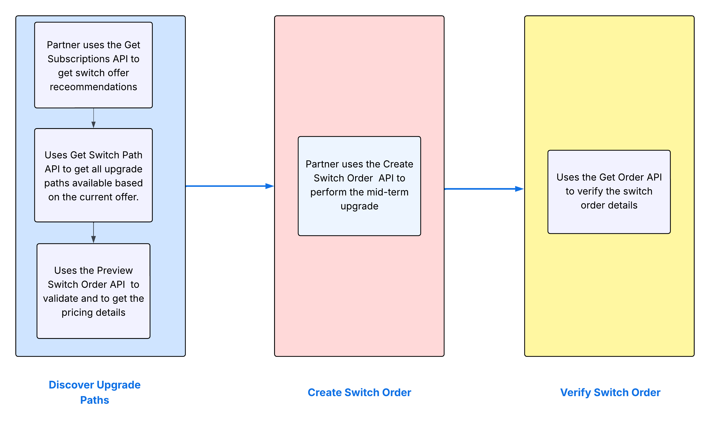

# Mid-term upgrades

The Mid-Term Upgrade capability in VIP Marketplace enables a partner to upgrade a customer's product subscription to a higher-tier product, like from Teams to Enterprise, at any point during their current term. This means a customer no longer has to wait until the renewal cycle to make changes.

## Advantages of mid-term upgrade

- **Customer flexibility**: Customers can access advanced features and higher-value products when needed, without waiting for the end of their subscription term.
- **Revenue acceleration**: Partners can capture upsell opportunities immediately, which improves annual recurring revenue and reduces deferred income.
- **Pricing transparency**: Provides prorated pricing, corrected discount levels, and refund estimates.

## Upgrade path

Customers can choose from a set of pre-defined upgrade paths for their product subscriptions at any point during their current term. A few examples:

- Acrobat Pro Teams to Acrobat Studio Teams
- Acrobat Studio Teams to Acrobat Studio Enterprise
- Acrobat Creative Cloud Teams to Acrobat Creative Cloud Pro Teams

You can use the [GET Product Switch Paths](./apis.md#3-retrieve-upgrade-paths) API to retrieve the upgrade paths that are available. Upgrade paths include a `switchType` indicator that defines whether the upgrade must be full or can be partial:

- **Full switch**  
  The entire quantity of the original subscription needs to be upgraded to the new product.

  **Example:** All 100 seats of Acrobat Standard Teams need to be switched to Acrobat Standard Enterprise.
  The upgrade path will be marked as FULL_ONLY.

- **Partial switch**  
  You can either switch the entire quantity or a certain number of the original subscription quantity.

  **Example:** Out of 100 seats, only 40 are switched to Acrobat Standard Enterprise, and the remaining 60 stay on the original product.
  If upgrade path is marked PARTIALLY_ALLOWED, the partner can perform either a partial or full upgrade.

**Note:** After a full switch, only the new product renews. After a partial switch, both products renew. The subscription's anniversary date remains unchanged.

## Reassigning users

During a mid-term upgrade from one Teams subscription to another, partners can automatically reassign users from the original subscription to the upgraded product. To enable this feature, include the query parameter `reassign-users=true` when submitting the switch order request.

User reassignment follows a Last-In-First-Out (LIFO) strategy, meaning the most recently assigned users are reassigned first.

**Note:** Automatic user reassignment is not supported for upgrades from Teams to Enterprise or between Enterprise subscriptions.

## Limitations

The following limitations are present in this release:

- **Complex upgrades excluded**: Combining multiple single apps into All Apps is not supported due to complexity in license mapping and pricing.
- **Partial upgrade restrictions**: Certain partial upgrades may be limited based on product eligibility or financial viability. Subscriptions tagged as high-growth offers or specific global customer products are excluded from switch eligibility.

## Mid-term upgrade process

The following figure illustrates the upgrade process:

For more information:

- [Discover upgrade paths](./apis.md#discover-upgrade-path)
- [Create switch order](./apis.md#apply-switch-plan)
- [Validate switch order](./apis.md#verify-switch-order)
- [Revert switch orders](./apis.md#revert-switch-order)
