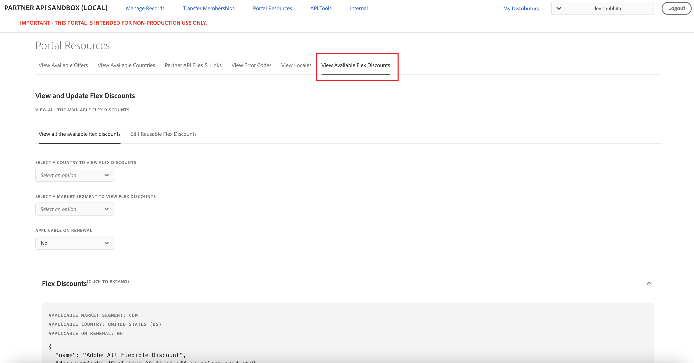
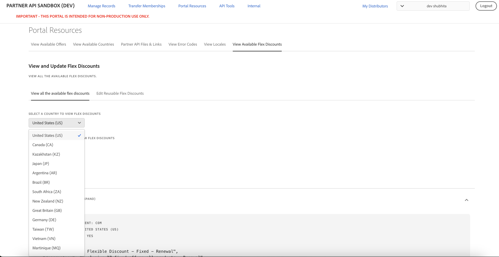
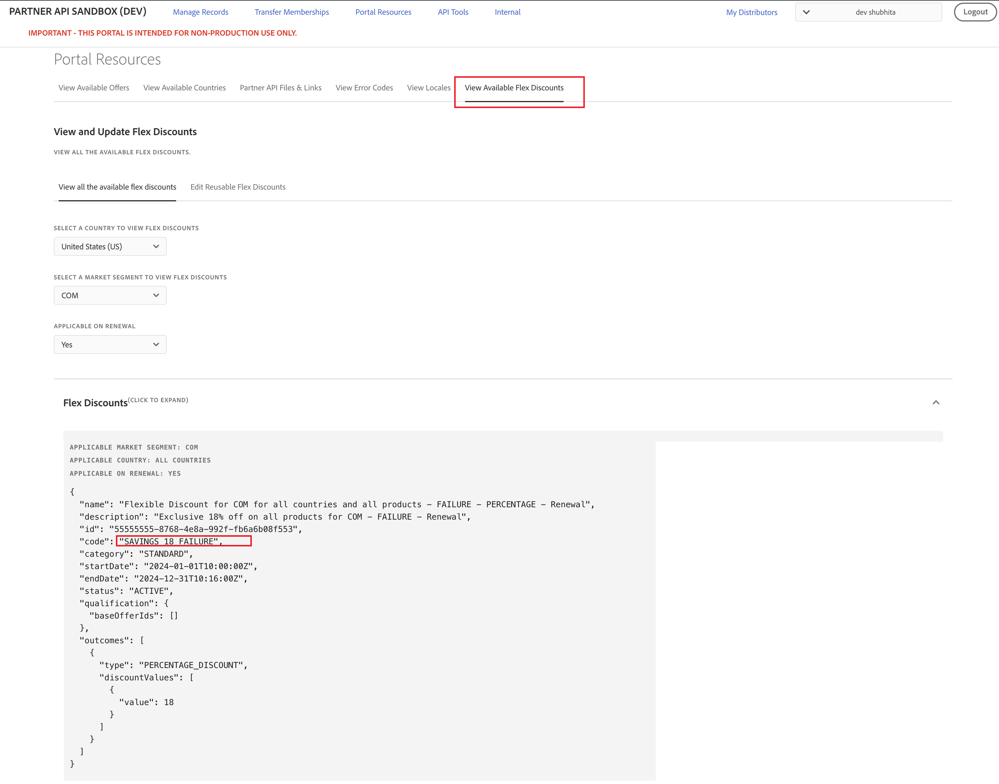
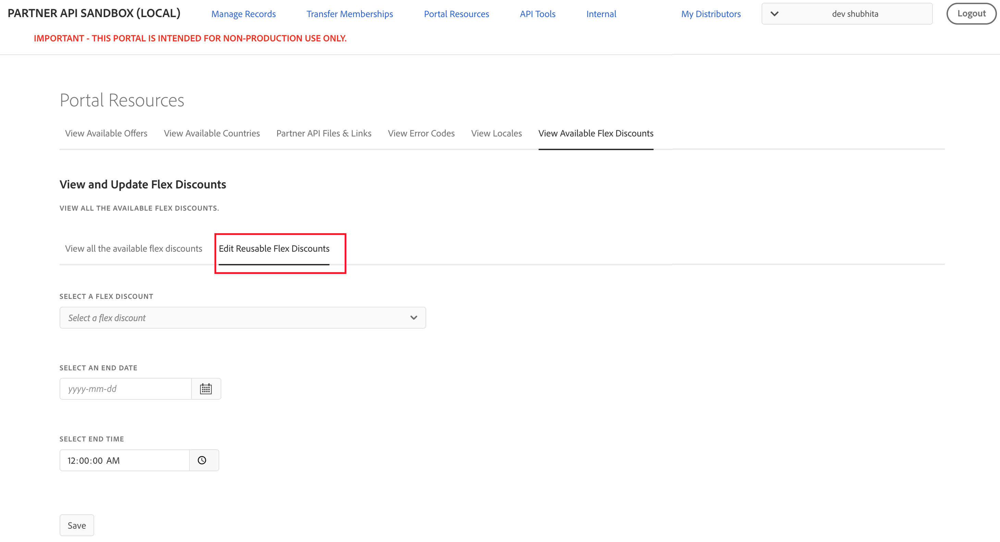

# Manage Flexible Discounts

Partners can get flexible discounts for a product in a specific market segment and country. These discounts can be applied while placing the order or creating a subscription. For detailed guidance on managing Flexible Discounts through APIs, refer to [Manage Flexible Discounts using APIs](../../../docs/flex-discounts/apis.md).

## Testing flexible discounts in Sandbox

You can explore and test the Flexible Discounts feature in the Sandbox environment using the following options:

- [View the available flexible discounts](#view-the-available-flexible-discounts)
- [Edit reusable flexible discounts](#edit-reusable-flexible-discounts)
- [View flexible discounts applied to an Order](#view-flexible-discounts-applied-to-an-order)
- [View flexible discounts applied to a subscription](#view-flexible-discounts-applied-to-a-subscription)

### View the available flexible discounts

Go to **Portal Resources > View Available Flex Discounts** to view the available flexible discounts, as shown in the following figure:

You can view Flexible Discounts applicable for all countries by selecting **All Countries**, as shown in the following figure:

The UI displays a list of current discounts, including the following details:

- Option to filter flexible discounts based on the applicable market segments.
- Option to filter flexible discounts based on the applicable country.
- Option to filter flexible discounts applicable for renewal or for new purchases.
- Name and description of the discount.
- Discount `code` to identify the discount. Use this code to apply the discounted price.
- `category` of the discount. Possible values are: `STANDARD` and `INTRO`.
- Start and end date of discount.
- Status of the discount. Only discounts with **ACTIVE** status are eligible.
- Offer IDs the discount applies to.
- Type and value of discount. A discount can have either fixed discount or a percentage discount on the price. For example, if the `type` is **FIXED DISCOUNT** and `value` is **20**, and `currency` is **USD**, this means a flat discount of $20 on the offer price.
- Discount lock end date for reusable flexible discounts. This date determines the date until a reusable flexible discount can continue to be used after its end date.

You can use the discount code while placing an order using the Create Order API.

**Note:** In the Sandbox environment, Flexible Discounts that include the term "FAILURE" in both the `name` and the `code` are specifically intended for validating failure scenarios. These codes are designed to always fail when used in PREVIEW and NEW order flows. All other discount codes can be used to validate successful application scenarios. Example:

### Edit reusable flexible discounts

Reusable flexible discounts allow partners to continue using a discount for a customer even after the discount end date, provided the discount is still within its discount lock end date and the customer has already used the discount before the original end date.

The discount lock end date is exposed in the [Get Flexible Discounts API](../../../docs/flex-discounts/apis.md#get-flexible-discounts) response and in the UI for reusable flexible discounts:

**Workflow to reuse a flexible discount after its end date**

To allow a customer to continue using a reusable flexible discount after its end date but before the discount lock end date, partners can perform the following steps:

1. Discover reusable flexible discounts

   Use the [Get Flexible Discounts API](../../../docs/flex-discounts/apis.md#get-flexible-discounts) and identify reusable flexible discounts by checking the presence of the discount lock end date.
2. Use the flexible discount before its end date

   Place an order for the customer using the reusable flexible discount before the discount end date.
3. Update the discount end date using the UI

   After the order is completed, go to **Portal Resources > View Available Flex Discounts > Edit Reusable Flex Discounts**.
4. Select the relevant reusable flexible discount and update its end date to a date that is later than the order creation date.
5. Reuse the flexible discount after its end date

   Even though the discount end date has passed, the reusable flexible discount can still be used for the same customer as long as the current date is before the discount lock end date.

### View flexible discounts applied to an Order

If a Flexible Discount is applied during order placement, its details can be viewed from the Order screen. For example, in **Manage Records > Orders**, the discount information appears within the `lineItems` section, as illustrated in the following figure:

The **flexDiscounts** section displays the discount code and indicates whether it was successfully applied to the order.

### View flexible discounts applied to a Subscription

In **Manage Records > Customers**,  the subscription details display any flexible discounts applied for the upcoming renewal.
Points to note:

- Flexible discounts are shown only if the customer has opted for them for the next renewal via the Update Subscription or Create Subscription API. For example:

  

- Flexible discounts that were applied to past orders are not reflected in the subscription details.
- If no flexible discount is applied for renewal, the FlexDiscountCode field remains empty. For example:

  
