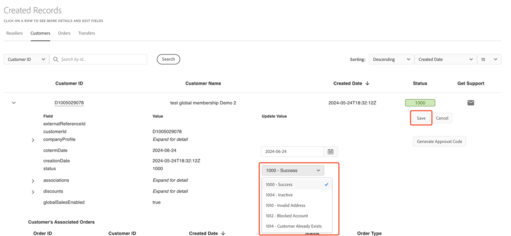
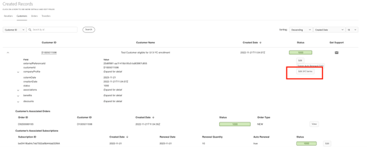
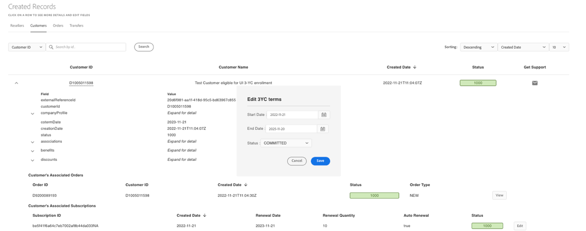
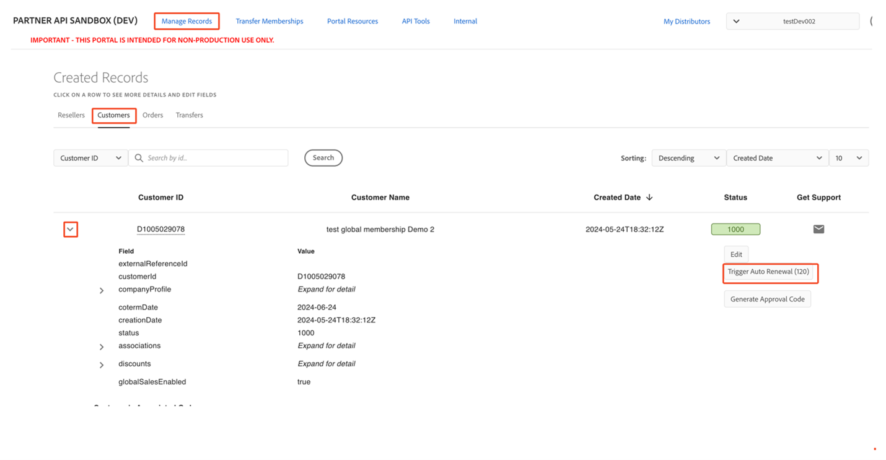
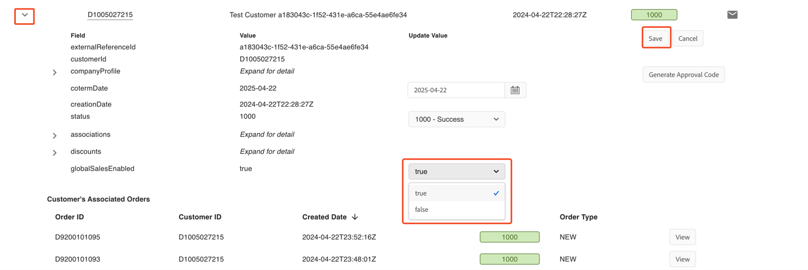

# Update customer details

You can update the following customer details:

- [Customer status](#edit-customer-status)
- [cotermDate](#set-the-cotermdate)
- [3YC commitment terms](#edit-3yc-commitment-terms)
- [Auto-renewal configuration](#trigger-auto-renewal)
- [Global Sales configuration](#enable-customer-for-global-sales)

To update customer details, navigate to **Manage Records > Customers**.

## Edit customer status

Perform the following steps to edit customer status:

1. Navigate to **Manage Records > Customers**
2. Expand the Customer view by selecting the down arrow next to the Customer ID, which will reveal the **Edit** button under the **Status** column:

3. Select **Edit**. This displays a dropdown menu with the five status options:

- 1000 - Success (default)
- 1004 - Inactive
- 1010 - Invalid Address
- 1012 - Blocked Account
- 1024 – Customer Already Exists

Each status is designated by a four-digit number.
4. Select the desired option.

5. Select **Save** to save the changes.

## Set the cotermDate

You can set the anniversary or cotermDate of a customer by following these steps:

1. Navigate to **Manage Records > Customers**
2. Expand the Customer view by selecting the down arrow next to the Customer ID, which will reveal the **Edit** button under the **Status** column:

3. Select **Edit**. Clicking the **Edit** button  discloses the date field under the **Update Value** column.

4. Enter the date using the following format: YYYY-MM-DD. Alternatively, a date may be chosen using the calendar function next to the date field. Click on the SAVE button to set the new cotermDate.

## Edit 3YC commitment terms

The 3YC commitment terms details such as status, and end/start date can be updated once the customer has an active commitment.

**Note:**  This option is available only in the Sandbox. You cannot modifiy this in the production environment.

To Edit 3YC commitment terms, select **Edit 3YC terms** in the expanded customer view.

Selecting the Edit 3YC terms button will enable you to edit the Start Date, End Date, and Status.

## Trigger Auto-renewal

**Note:**  This option is available only in the Sandbox. You cannot modifiy this in the production environment.

To trigger auto-renewal, expand the Customer view by clicking on the down arrowhead next to the desired customer ID, which will reveal the Trigger Auto Renewal button.

**Note:** Auto-renewals can be triggered once every 120 seconds. A counter will display the time remaining.

Renewals will be managed at the subscription level. Triggering auto-renewal will create a renewal order for this customer. If a reseller or customer is inactive, the order will fail with an error.

## Enable customer for Global Sales

To edit the global status of a customer:

1. Expand the Customer view by clicking on the down arrowhead next to the desired customer ID.
2. Select the **Edit** button to the right of the customer’s expanded details page.
Update the `globalSalesEnabled` field to true/false and select the **Save** to save your selection.

**Notes:**

- Resellers do not need to be enabled for Global Sales.
- Only customers in the COMMERCIAL market segment (COM) can be enabled for Global Sales.
- Customers must be associated with a reseller in the COMMERCIAL market segment.
