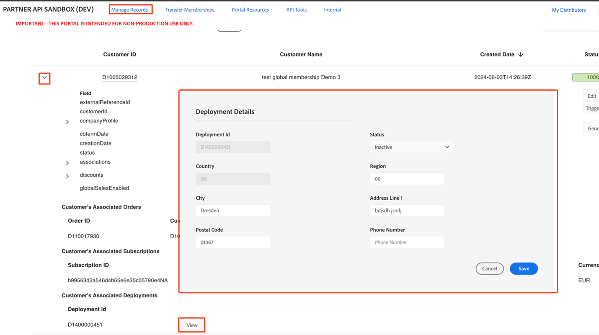

# Management deployments

For global customers to purchase offers outside their home country, they must create and use deployment resources. This topic will help you to:

- [Create a deployment](#create-a-deployment)
- [Update a deployment](#update-a-deployment)
- [Deactivate a deployment](#deactivate-a-deployment)
- [View deployments](#view-deployments)

## Create a deployment

You can create deployments using the [Commerce Partner API Postman Collection](https://adobe.sharepoint.com/sites/VIPMarketplacePartners/PreRelease%20Materials/Forms/AllItems.aspx?csf=1&web=1&e=YyIk9K&CID=711c91d7-47d9-4d68-b83b-c15c1abbd860&FolderCTID=0x01200089886E87F1725140BF9E471CF714C925&id=%2Fsites%2FVIPMarketplacePartners%2FPreRelease+Materials%2FTechnical+Assets). Select the **Deployment Management** folder and select the `POST Create Deployment` request.

For more details on the API, refer to  [External API documentation](/src/pages/docs/index.md).

## Update a deployment

Follow these steps to edit a deployment in the Sandbox Portal:

1. Navigate to **Manage Records > Customers**
2. Expand the desired **Global Sales enabled customer’s** details.
3. Go to the **Customer’s Associated Deployments** section.
4. Select the **View** button next to the customer’s `deploymentId` that needs to be updated
5. Modify the fields. All fields that are not greyed out are editable.
6. Select **Save** to save the changes.

**Note:** Once the deployment’s country is set, it cannot be changed.

## Deactivate a deployment

A deployment can be deactivated through the Sandbox Portal or through an  API call.

- To deactivate through the Sandbox Portal, follow the steps provided in the section ‘Updating a Deployment’ and update the status field to ‘1004’.
- To deactivate through an API call, refer to [deactivate a deployment](/src/pages/docs/deployment_management/update_deployment.md).

## View deployments

To view the deployments for a customer:

1. Navigate to **Manage Records > Customers**.
2. Expand the customer. All the deployments associated with the customer are displayed.

3. To view details of each deployment, select **View** next to the deployment ID.

